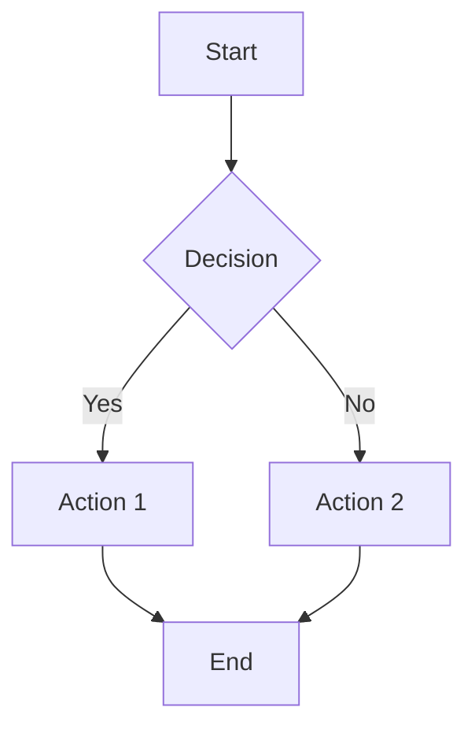

# GitHub Flavored Markdown (GFM) Complete Syntax Guide

This document demonstrates **all** features of GitHub Flavored Markdown.

---

## 1. Headings

# Heading 1 (H1)
## Heading 2 (H2)
### Heading 3 (H3)
#### Heading 4 (H4)
##### Heading 5 (H5)
###### Heading 6 (H6)

Alternative H1 and H2:
==================

Alternative H2:
------------------

---

## 2. Text Styling

**Bold text** using double asterisks  
__Bold text__ using double underscores  
*Italic text* using single asterisks  
_Italic text_ using single underscores  
***Bold and italic*** using triple asterisks  
___Bold and italic___ using triple underscores  
**Bold with _nested italic_**  
*Italic with **nested bold***  
~~Strikethrough~~ using double tildes  
**~~Bold strikethrough~~**  
*~~Italic strikethrough~~*  
<sub>Subscript</sub> using `<sub>` tags  
<sup>Superscript</sup> using `<sup>` tags  
<kbd>Ctrl</kbd> + <kbd>S</kbd> for keyboard keys  
<ins>Inserted text</ins> (underlined)  
<mark>Highlighted text</mark>

---

## 3. Paragraphs and Line Breaks

This is a paragraph. It can span multiple lines and will be rendered as a single block of text. Lorem ipsum dolor sit amet, consectetur adipiscing elit.

This is a new paragraph, separated by a blank line.

This line has a hard break at the end  
(using two trailing spaces)  
like this.

---

## 4. Blockquotes

> This is a blockquote.
> It can span multiple lines.

> Blockquotes can also be nested.
>> This is a nested blockquote.
>>> And even deeper nesting.

> **Bold** and *italic* work in blockquotes too.
> 
> - Lists work inside blockquotes
> - As demonstrated here
> 
> ```
> Code blocks work too
> ```

---

## 5. Lists

### Unordered Lists

- Item 1
- Item 2
  - Nested item 2.1
  - Nested item 2.2
    - Deeply nested 2.2.1
    - Deeply nested 2.2.2
- Item 3

* Alternative bullet with asterisk
+ Alternative bullet with plus

### Ordered Lists

1. First item
2. Second item
3. Third item
   1. Nested numbered item 3.1
   2. Nested numbered item 3.2
4. Fourth item

### Task Lists (GFM Feature)

- [x] Completed task
- [ ] Incomplete task
- [ ] Another incomplete task
  - [x] Nested completed task
  - [ ] Nested incomplete task

### Mixed Lists

1. Ordered item 1
   - Unordered sub-item
   - Another sub-item
2. Ordered item 2
   1. Ordered sub-item 2.1
   2. Ordered sub-item 2.2

---

## 6. Code

### Inline Code

Use `console.log("Hello World")` for inline code.

Use backticks for `` `code` `` containing backticks: `` ` ``.

### Fenced Code Blocks

Simple code block:
```
This is a code block
with multiple lines
```

With language identifier:
```javascript
function greet(name) {
  console.log(`Hello, ${name}!`);
  return true;
}

greet("GitHub");
```

```python
def fibonacci(n):
    if n <= 1:
        return n
    return fibonacci(n-1) + fibonacci(n-2)

print(f"Fibonacci(10) = {fibonacci(10)}")
```

```bash
#!/bin/bash
echo "Hello from Bash!"
ls -la
git status
```

### Diff Syntax Highlighting

```diff
+ This line was added
- This line was removed
  This line is unchanged
```

### Code Block with Line Numbers (GitHub renders these)

```ruby
# Ruby example
class Person
  attr_accessor :name
  
  def initialize(name)
    @name = name
  end
  
  def greet
    puts "Hello, I'm #{@name}"
  end
end
```

---

## 7. Horizontal Rules

Using three hyphens:

---

Using three asterisks:

***

Using three underscores:

___

Using more than three:

-----

---

## 8. Links

### Basic Links

[Link to GitHub](https://github.com)

[Link with title](https://github.com "GitHub Homepage")

### Reference-Style Links

[Link text][ref1]

[Another link][ref2]

[ref1]: https://github.com
[ref2]: https://docs.github.com "GitHub Documentation"

### Automatic Links

<https://github.com>  
<mailto:example@email.com>

### Relative Links

[Link to README](./README.md)  
[Link to docs](../docs/guide.md)

### Links to Anchors

[Go to Headings section](#1-headings)  
[Go to Code section](#6-code)

---

## 9. Images

### Basic Images


### Image with Title


### Reference-Style Images

![GitHub Logo][github-logo]

[github-logo]: https://github.githubassets.com/images/modules/logos_page/GitHub-Mark.png

### Image with Link

[](https://github.com)

---

## 10. Tables (GFM Feature)

### Simple Table

| Header 1 | Header 2 | Header 3 |
|----------|----------|----------|
| Cell 1   | Cell 2   | Cell 3   |
| Cell 4   | Cell 5   | Cell 6   |

### Alignment

| Left-aligned | Center-aligned | Right-aligned |
|:-------------|:--------------:|--------------:|
| Left         | Center         | Right         |
| L            | C              | R             |

### Table with Formatting

| Feature | Status | Notes |
|:--------|:------:|------:|
| **Bold** | ✅ | Working |
| *Italic* | ✅ | Working |
| `Code` | ✅ | Working |
| [Link](https://github.com) | ✅ | Working |

### Compact Table (no outer pipes)

Header 1 | Header 2
---------|---------
Cell 1   | Cell 2
Cell 3   | Cell 4

---

## 11. Escaping Characters

Use backslash to escape:

\* Not italic \*  
\` Not code \`  
\# Not a heading  
\[Not a link\](url)

Escaped characters: \! \@ \# \$ \% \^ \& \* \( \) \_ \- \+ \= \{ \} \[ \] \| \: \; \' \" \, \. \< \> \/ \? \` \~

---

## 12. HTML Elements

<details>
<summary>Click to expand!</summary>

Hidden content goes here!

- Item 1
- Item 2

</details>

<div align="center">

**Centered content using HTML**

</div>

<span style="color: red;">Red text</span> (may not work in all renderers)

---

## 13. Footnotes (GFM Extended)

Here's a sentence with a footnote. [^1]

[^1]: This is the footnote content.

Multiple footnotes [^2] in a single paragraph [^3].

[^2]: Second footnote.
[^3]: Third footnote with longer content.
    Indent to include multiple paragraphs in a footnote.

---

## 14. Emoji (GFM Shortcodes) 🎉

:smile: :heart: :thumbsup: :rocket: :fire: :star: :sparkles:

:octocat: GitHub's mascot

---

## 15. Mentions and References

@username - Mention a user  
@organization/team - Mention a team  
#1 - Reference an issue  
GH-1 - Reference an issue  
https://github.com/user/repo/issues/1 - Automatic issue link  

---

## 16. Math (LaTeX - Some renderers support this)

Inline math: $E = mc^2$

Block math:
$$
\sum_{i=1}^{n} x_i = x_1 + x_2 + \cdots + x_n
$$

---

## 17. Diagrams (Mermaid - GitHub supports this)



---

## 18. Special GitHub Features

### Alerts/Admonitions

> [!NOTE]
> This is a note alert.

> [!TIP]
> This is a tip alert.

> [!IMPORTANT]
> This is an important alert.

> [!WARNING]
> This is a warning alert.

> [!CAUTION]
> This is a caution alert.

### Collapsible Sections (HTML)

<details open>
<summary><b>Open by Default</b></summary>

This section starts expanded!

</details>

### Embed YouTube Video (HTML)

<a href="https://www.youtube.com/watch?v=dQw4w9WgXcQ">
  
</a>

---

## 19. Comments

<!-- This is an HTML comment and won't be rendered -->

[comment]: # (This is also a comment)

<!--- Multi-line
comment --->

---

## 20. Definition Lists (Some renderers)

Term 1
: Definition 1

Term 2
: Definition 2a
: Definition 2b

---

## End of Document

This covers all major features of GitHub Flavored Markdown! 🎉
